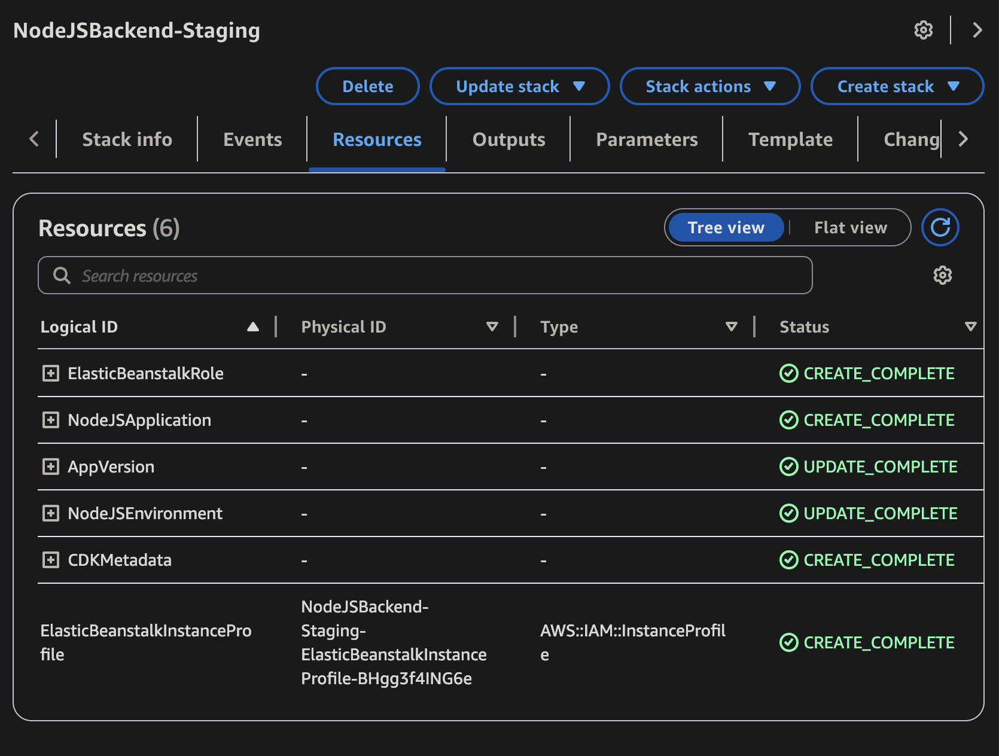

# Web Server Deployment on AWS

[English](README.md) | [中文](README.zh.md)

A TypeScript-based AWS CDK project for deploying web applications (Node.js and Django) to AWS Elastic Beanstalk. This project provides a robust and scalable solution for hosting web applications using AWS services.

## Features

- Automated infrastructure creation and continuous deployment using AWS CDK
- Support for both Node.js and Django backend deployments
- Environment-based deployment (staging and production)
- Optional custom domain configuration with SSL certificates
- Comprehensive logging and monitoring setup
- Auto-scaling configuration for web applications
- Enhanced health reporting and metrics

## Prerequisites

- AWS Account
- AWS CLI installed ([Reference](https://docs.aws.amazon.com/cli/latest/userguide/getting-started-install.html#getting-started-install-instructions)) and configured with appropriate credentials ([Reference](https://docs.aws.amazon.com/cli/latest/userguide/getting-started-quickstart.html#getting-started-quickstart-new)). To try out quickly, I recommend to use CLI commands with long-term credentials:
  ```
  aws configure
  ```
- AWS CDK CLI installed globally ([Reference](https://docs.aws.amazon.com/cdk/v2/guide/getting-started.html#getting-started-install)):
  ```
  npm install -g aws-cdk
  ```

## Installation

1. Clone the repository:

```bash
git clone https://github.com/shuo-s-feng/web-server-on-aws.git
cd web-server-on-aws
```

2. Install dependencies:

```bash
yarn install
```

## Project Structure

```
.
├── bin/                    # CDK app entry points
│   ├── deploy-nodejs-backend.ts    # Node.js backend deployment
│   └── deploy-django-backend.ts    # Django backend deployment
├── src/                    # Source code
│   ├── stacks/            # CDK stacks
│   └── utils/             # Utility functions
├── examples/              # Example web app source code
└── cdk.out/              # CDK synthesis output
```

## Environment Configuration

The project uses environment-specific configuration files to manage different deployment environments. Update the following files in the root directory:

### `.env.staging`

```bash
# AWS Configuration
AWS_ACCOUNT='<AWS_ACCOUNT_ID, e.g. 123456789012>'
AWS_REGION='<AWS_REGION, e.g. us-east-1>'

# Node.js Backend Configuration
NODEJS_BACKEND_APP_NAME='<APP_NAME, e.g. NodeJSBackend>'
# NODEJS_BACKEND_DOMAIN_NAME='<DOMAIN_NAME, e.g. api.example.com>'
# NODEJS_BACKEND_DOMAIN_CERT_ARN='<SSL_CERTIFICATE_ARN, e.g. arn:aws:acm:region:account:certificate/xxxx-xxxx-xxxx-xxxx>'
NODEJS_BACKEND_SOURCE_PATH='<SOURCE_PATH, e.g. ./examples/nodejs-backend-dist>'
# NODEJS_BACKEND_EC2_INSTANCE_TYPE='<INSTANCE_TYPE, e.g. t3.small>'
# NODEJS_BACKEND_MIN_INSTANCES='<MIN_INSTANCES, e.g. 1>'
# NODEJS_BACKEND_MAX_INSTANCES='<MAX_INSTANCES, e.g. 2>'
# NODEJS_BACKEND_ENABLE_WEB_SERVER_LOGS='<true/false>'
# NODEJS_BACKEND_ENABLE_HEALTH_EVENT_LOGS='<true/false>'
# NODEJS_BACKEND_ENABLE_HEALTH_REPORTING='<true/false>'

# Django Backend Configuration
DJANGO_BACKEND_APP_NAME='<APP_NAME, e.g. DjangoBackend>'
# DJANGO_BACKEND_DOMAIN_NAME='<DOMAIN_NAME, e.g. api.example.com>'
# DJANGO_BACKEND_DOMAIN_CERT_ARN='<SSL_CERTIFICATE_ARN, e.g. arn:aws:acm:region:account:certificate/xxxx-xxxx-xxxx-xxxx>'
DJANGO_BACKEND_SOURCE_PATH='<SOURCE_PATH, e.g. ./examples/django-backend-dist>'
# DJANGO_BACKEND_EC2_INSTANCE_TYPE='<INSTANCE_TYPE, e.g. t3.small>'
# DJANGO_BACKEND_MIN_INSTANCES='<MIN_INSTANCES, e.g. 1>'
# DJANGO_BACKEND_MAX_INSTANCES='<MAX_INSTANCES, e.g. 2>'
# DJANGO_BACKEND_ENABLE_WEB_SERVER_LOGS='<true/false>'
# DJANGO_BACKEND_ENABLE_HEALTH_EVENT_LOGS='<true/false>'
# DJANGO_BACKEND_ENABLE_HEALTH_REPORTING='<true/false>'
```

### `.env.prod`

```bash
# AWS Configuration
AWS_ACCOUNT='<AWS_ACCOUNT_ID, e.g. 123456789012>'
AWS_REGION='<AWS_REGION, e.g. us-east-1>'

# Node.js Backend Configuration
NODEJS_BACKEND_APP_NAME='<APP_NAME, e.g. NodeJSBackend>'
# NODEJS_BACKEND_DOMAIN_NAME='<DOMAIN_NAME, e.g. api.example.com>'
# NODEJS_BACKEND_DOMAIN_CERT_ARN='<SSL_CERTIFICATE_ARN, e.g. arn:aws:acm:region:account:certificate/xxxx-xxxx-xxxx-xxxx>'
NODEJS_BACKEND_SOURCE_PATH='<SOURCE_PATH, e.g. ./examples/nodejs-backend-dist>'
# NODEJS_BACKEND_EC2_INSTANCE_TYPE='<INSTANCE_TYPE, e.g. t3.small>'
# NODEJS_BACKEND_MIN_INSTANCES='<MIN_INSTANCES, e.g. 1>'
# NODEJS_BACKEND_MAX_INSTANCES='<MAX_INSTANCES, e.g. 2>'
# NODEJS_BACKEND_ENABLE_WEB_SERVER_LOGS='<true/false>'
# NODEJS_BACKEND_ENABLE_HEALTH_EVENT_LOGS='<true/false>'
# NODEJS_BACKEND_ENABLE_HEALTH_REPORTING='<true/false>'

# Django Backend Configuration
DJANGO_BACKEND_APP_NAME='<APP_NAME, e.g. DjangoBackend>'
# DJANGO_BACKEND_DOMAIN_NAME='<DOMAIN_NAME, e.g. api.example.com>'
# DJANGO_BACKEND_DOMAIN_CERT_ARN='<SSL_CERTIFICATE_ARN, e.g. arn:aws:acm:region:account:certificate/xxxx-xxxx-xxxx-xxxx>'
DJANGO_BACKEND_SOURCE_PATH='<SOURCE_PATH, e.g. ./examples/django-backend-dist>'
# DJANGO_BACKEND_EC2_INSTANCE_TYPE='<INSTANCE_TYPE, e.g. t3.small>'
# DJANGO_BACKEND_MIN_INSTANCES='<MIN_INSTANCES, e.g. 1>'
# DJANGO_BACKEND_MAX_INSTANCES='<MAX_INSTANCES, e.g. 2>'
# DJANGO_BACKEND_ENABLE_WEB_SERVER_LOGS='<true/false>'
# DJANGO_BACKEND_ENABLE_HEALTH_EVENT_LOGS='<true/false>'
# DJANGO_BACKEND_ENABLE_HEALTH_REPORTING='<true/false>'
```

Replace the placeholder values with your actual configuration. The commented lines are optional and can be uncommented if you want to use a custom domain with SSL certificate.

## Deployment

### Environment Setup

1. Update the environment configuration files as described above
2. Fill in the appropriate values for your AWS account and application configuration
3. If using a custom domain, uncomment and configure the domain-related variables

### Node.js Backend Deployment

#### Staging Environment

```bash
yarn deploy-nodejs-backend:staging
```

#### Production Environment

```bash
yarn deploy-nodejs-backend:prod
```

### Django Backend Deployment

#### Staging Environment

```bash
yarn deploy-django-backend:staging
```

#### Production Environment

```bash
yarn deploy-django-backend:prod
```

Note: Make sure your AWS credentials are properly configured before deployment. The deployment process will use the environment-specific configuration from the respective `.env.*` file.

## Created AWS Resources

After deployment, the following main resources will be created in your AWS account:

- **CloudFormation** - Centralized management of all AWS resources related to deployment
- **Elastic Beanstalk Application** - Container for the web application
- **Elastic Beanstalk Environment** - Runtime environment for the application
- **EC2 Instances** - Auto-scaling group of instances running the application
- **Application Load Balancer** - Distributes traffic across instances
- **CloudWatch Logs** - Application and health event logs (if enabled)
- **CloudWatch Metrics** - Enhanced health reporting metrics (if enabled)
- **Route 53 Records** - Custom domain configuration (if enabled)

CloudFormation example screenshot (NodeJS):



You can access your application through:

- **Elastic Beanstalk domain:** The environment domain is shown in the AWS Console for your environment. For example (NodeJS):

  

  In the AWS Elastic Beanstalk Console, navigate to your environment (e.g., `NodeJSBackend-Staging` or `DjangoBackend-Staging`). The environment overview panel will display the domain under the "Domain" section, as shown above. This is the URL you can use to access your deployed backend.

- **Custom domain (if configured):** `https://{your-api-domain-name}`
