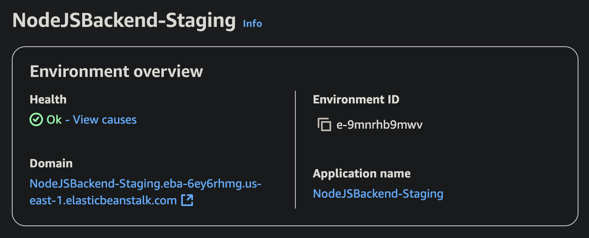

# AWS Web 服务器部署

[English](README.md) | [中文](README.zh.md)

这是一个基于 TypeScript 的 AWS CDK 项目，用于将 Web 应用程序（Node.js、Django 和 Docker）部署到 AWS Elastic Beanstalk。该项目提供了强大且可扩展的解决方案，用于使用 AWS 服务托管 Web 应用程序。

## 功能特点

- 使用 AWS CDK 自动创建和持续部署基础设施
- 支持多种后端类型：Node.js、Django 和 Docker
- 基于环境的部署（测试环境和生产环境）
- 可选的自定义域名配置和 SSL 证书
- 全面的日志记录和监控设置
- Web 应用程序的自动扩展配置
- 增强的健康报告和指标

## 前置要求

- 海外 AWS 账户
- 安装 AWS CLI（[参考文档](https://docs.aws.amazon.com/zh_cn/cli/latest/userguide/getting-started-install.html#getting-started-install-instructions)）并配置适当的凭证（[参考文档](https://docs.aws.amazon.com/zh_cn/cli/latest/userguide/getting-started-quickstart.html#getting-started-quickstart-new)）。为了快速尝试，我建议使用带有长期凭证（`Long-term credentials`）的 CLI 命令：
  ```
  aws configure
  ```
- 全局安装 AWS CDK CLI（[参考文档](https://docs.aws.amazon.com/zh_cn/cdk/v2/guide/getting-started.html#getting-started-install)）：
  ```
  npm install -g aws-cdk
  ```

## 安装步骤

1. 克隆仓库：

```bash
git clone https://github.com/shuo-s-feng/web-server-on-aws.git
cd web-server-on-aws
```

2. 安装依赖：

```bash
yarn install
```

## 项目结构

```
.
├── bin/                    # CDK 应用入口点
│   └── deploy-elastic-beanstalk.ts    # Elastic Beanstalk 部署
├── lib/                    # CDK 构造
│   └── elastic-beanstalk/  # Elastic Beanstalk 构造
├── configs/                # 环境配置文件
│   ├── .env.staging.django # Django 测试环境配置
│   ├── .env.staging.nodejs # Node.js 测试环境配置
│   ├── .env.staging.docker # Docker 测试环境配置
│   ├── .env.prod.django    # Django 生产环境配置
│   ├── .env.prod.nodejs    # Node.js 生产环境配置
│   └── .env.prod.docker    # Docker 生产环境配置
└── examples/               # 示例 Web 应用源代码
    ├── django-backend-dist/    # Django 示例应用程序
    ├── nodejs-backend-dist/    # Node.js 示例应用程序
    └── docker-backend-dist/    # Docker 示例应用程序
```

## 环境配置

项目使用特定于环境和后端类型的配置文件来管理不同的部署环境。每种后端类型都有自己的配置文件，以便更好地组织和清晰管理。

### 配置文件结构

- **Django 后端**: `configs/.env.{environment}.django`
- **Node.js 后端**: `configs/.env.{environment}.nodejs`
- **Docker 后端**: `configs/.env.{environment}.docker`

其中 `{environment}` 可以是 `staging` 或 `prod`。

### 配置示例

#### Django 后端核心配置 (`.env.staging.django`)

```bash
# AWS 配置
AWS_ACCOUNT='<AWS_ACCOUNT, e.g. 123456789012>'
AWS_REGION='<AWS_REGION, e.g. us-east-1>'

# Elastic Beanstalk 应用程序名称
BACKEND_APP_NAME='DjangoBackend'

# Elastic Beanstalk 环境的解决方案堆栈名称
# 参考: https://docs.aws.amazon.com/elasticbeanstalk/latest/platforms/platforms-supported.html#platforms-supported.python
# 部署前请检查最新的解决方案堆栈名称，因为它可能经常更改，旧的可能会部署失败
BACKEND_SOLUTION_STACK_NAME='64bit Amazon Linux 2023 v4.5.2 running Python 3.12'

# (可选) 应用程序的自定义域名
# BACKEND_DOMAIN_NAME='example.com'

# (可选) 用于 HTTPS 支持的 ACM SSL 证书 ARN
# BACKEND_DOMAIN_CERT_ARN='arn:aws:acm:region:account:certificate/xxxx-xxxx-xxxx-xxxx'

# 应用程序源代码的本地路径
BACKEND_SOURCE_PATH='./examples/django-backend-dist'

# Django 应用程序的 WSGI 路径
DJANGO_BACKEND_WSGI_PATH='hello_world.wsgi:application'

# Django 应用程序的静态文件路径
BACKEND_STATIC_FILES_PATH='/staticfiles'
```

#### Node.js 后端核心配置 (`.env.staging.nodejs`)

```bash
# AWS 配置
AWS_ACCOUNT='<AWS_ACCOUNT, e.g. 123456789012>'
AWS_REGION='<AWS_REGION, e.g. us-east-1>'

# Elastic Beanstalk 应用程序名称
BACKEND_APP_NAME='NodeJsBackend'

# Elastic Beanstalk 环境的解决方案堆栈名称
# 参考: https://docs.aws.amazon.com/elasticbeanstalk/latest/platforms/platforms-supported.html#platforms-supported.nodejs
# 部署前请检查最新的解决方案堆栈名称，因为它可能经常更改，旧的可能会部署失败
BACKEND_SOLUTION_STACK_NAME='64bit Amazon Linux 2023 v6.5.2 running Node.js 22'

# (可选) 应用程序的自定义域名
# BACKEND_DOMAIN_NAME='example.com'

# (可选) 用于 HTTPS 支持的 ACM SSL 证书 ARN
# BACKEND_DOMAIN_CERT_ARN='arn:aws:acm:region:account:certificate/xxxx-xxxx-xxxx-xxxx'

# 应用程序源代码的本地路径
BACKEND_SOURCE_PATH='./examples/nodejs-backend-dist'
```

#### Docker 后端核心配置 (`.env.staging.docker`)

```bash
# AWS 配置
AWS_ACCOUNT='<AWS_ACCOUNT, e.g. 123456789012>'
AWS_REGION='<AWS_REGION, e.g. us-east-1>'

# Elastic Beanstalk 应用程序名称
BACKEND_APP_NAME='DockerBackend'

# Elastic Beanstalk 环境的解决方案堆栈名称
# 参考: https://docs.aws.amazon.com/elasticbeanstalk/latest/platforms/platforms-supported.html#platforms-supported.docker
# 部署前请检查最新的解决方案堆栈名称，因为它可能经常更改，旧的可能会部署失败
BACKEND_SOLUTION_STACK_NAME='64bit Amazon Linux 2023 v4.5.2 running Docker'

# (可选) 应用程序的自定义域名
# BACKEND_DOMAIN_NAME='example.com'

# (可选) 用于 HTTPS 支持的 ACM SSL 证书 ARN
# BACKEND_DOMAIN_CERT_ARN='arn:aws:acm:region:account:certificate/xxxx-xxxx-xxxx-xxxx'

# 应用程序源代码的本地路径
BACKEND_SOURCE_PATH='./examples/docker-backend-dist'

# Docker 应用程序的容器端口
DOCKER_BACKEND_CONTAINER_PORT='3000'
```

### 配置设置

1. 根据您的后端类型和环境选择适当的配置文件
2. 使用您的实际 AWS 账户和应用程序设置更新配置值
3. 用您的特定配置替换占位符值
4. 对于自定义域名支持，取消注释并配置域名相关变量

## 部署

### 环境设置

1. 按照上述说明更新适当的环境配置文件
2. 填写适合您 AWS 账户和应用程序配置的正确值
3. 如果使用自定义域名，请取消注释并配置域名相关变量

### 部署命令

#### Django 后端部署

**测试环境:**

```bash
yarn deploy-django-backend:staging
```

**生产环境:**

```bash
yarn deploy-django-backend:prod
```

#### Node.js 后端部署

**测试环境:**

```bash
yarn deploy-nodejs-backend:staging
```

**生产环境:**

```bash
yarn deploy-nodejs-backend:prod
```

#### Docker 后端部署

**测试环境:**

```bash
yarn deploy-docker-backend:staging
```

**生产环境:**

```bash
yarn deploy-docker-backend:prod
```

**注意:** 部署前请确保您的 AWS 凭证已正确配置。部署过程将使用相应 `.env.*.*` 文件中的环境特定配置。

## 创建的 AWS 资源

部署后，以下的主要资源将在您的 AWS 账户中创建：

- **CloudFormation** - 中心化管理部署相关的所有 AWS 资源
- **Elastic Beanstalk Application** - Web 应用程序的容器
- **Elastic Beanstalk Environment** - 应用程序的运行环境
- **EC2 Instances** - 运行应用程序的自动扩展实例组
- **Application Load Balancer** - 在实例之间分配流量
- **CloudWatch Logs** - 应用程序和健康事件日志（如果启用）
- **CloudWatch Metrics** - 增强的健康报告指标（如果启用）
- **Route 53 Records** - 自定义域名配置（如果启用）

CloudFormation 示例截图（NodeJS）：


您可以通过以下方式访问您的应用程序：

- **Elastic Beanstalk 域名：** 环境域名会显示在 AWS 控制台的环境页面。例如（NodeJS）：

  

  在 AWS Elastic Beanstalk 控制台，进入您的环境（如 `NodeJSBackend-Staging` 或 `DjangoBackend-Staging`），在环境概览面板的"Domain"部分可以看到如上图所示的域名。这就是您访问已部署后端的 URL。

- **自定义域名（如已配置）：** `https://{your-api-domain-name}`
